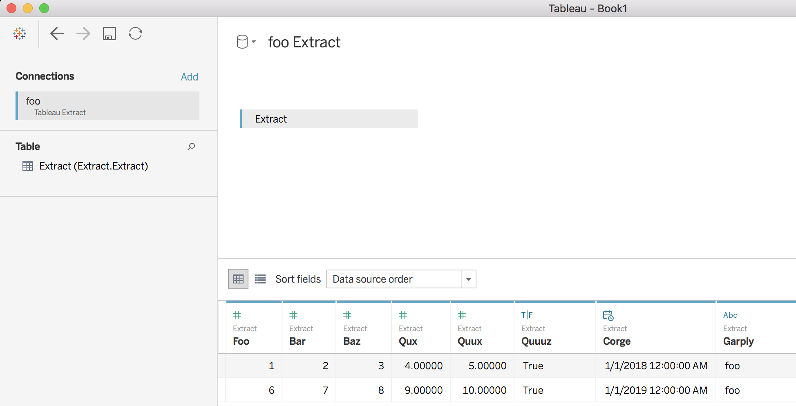

Official documentation for the project and all of its features is hosted at:

https://pantab.readthedocs.io/en/latest/index.html

A quick summary is provided for convenience below.

# pantab: Connecting pandas with Tableau

## What is it?

**pantab** is a tool to help read and write Hyper extracts (available with Tableau 10.5+) from a pandas DataFrame.


```python
import pandas as pd
import pantab

df = pd.DataFrame(
    [[1, 2, 3, 4., 5., True, pd.to_datetime('1/1/18'), 'foo'],
     [6, 7, 8, 9., 10., True, pd.to_datetime('1/1/19'), 'foo']
     ], columns=['foo', 'bar', 'baz', 'qux', 'quux', 'quuuz', 'corge',
                 'garply'])

pantab.frame_to_hyper(df, "foo.hyper", table="the_table")
```

The above will generate a Hyper extract in the specified location, which you can then open in Tableau.



You can also read the same extract back in as follows:

```python
df = pantab.frame_from_hyper("foo.hyper", table="the_table")
```

## Requirements & Installation

* Python >= 3.6
* Tableau Hyper API (see installation instructions [here](https://help.tableau.com/current/api/hyper_api/en-us/docs/hyper_api_installing.html#install-the-hyper-api-for-python-36-and-37))
* [pandas](https://pandas.pydata.org)

The preferred way to install this package is from pip. Note that this will resolve the pandas dependency for you but **will not resolve the Tableau Hyper API** dependency. Please refer to their installation instructions.

```sh
pip install pantab
```
