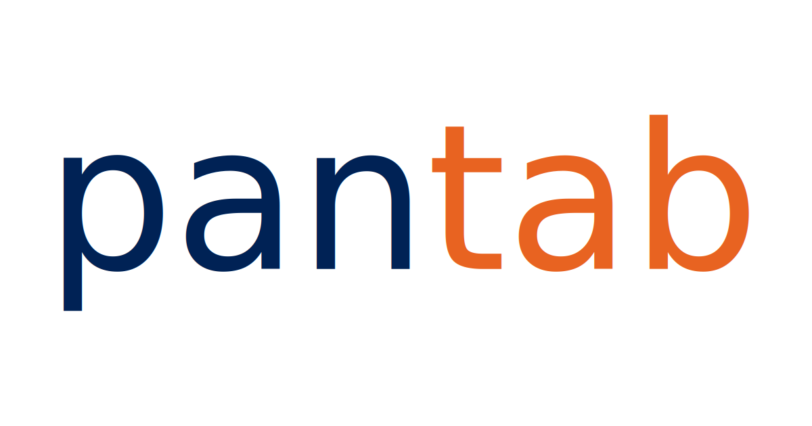

# Getting Help

## Documentation
Official documentation for the project and all of its features is hosted at:

https://pantab.readthedocs.io/en/latest/index.html

## Community

If you'd like to chat with the developer(s) or other users in the community, freel free to join the [Hyper API slack channel](https://join.slack.com/t/tableau-datadev/shared_invite/zt-1q4rrimsh-lHHKzrhid1MR4aMOkrnAFQ).

## Licensing

pantab is distributed under the 3-Clause BSD license, but includes vendored pieces of numpy (see numpy_datetime.* files). Binary distributions of pantab include the Tableau Hyper shared library and executable. See LICENSE.txt, NUMPY_LICENSE.txt and TABLEAU_HYPER_LICENSE.txt respectively.
