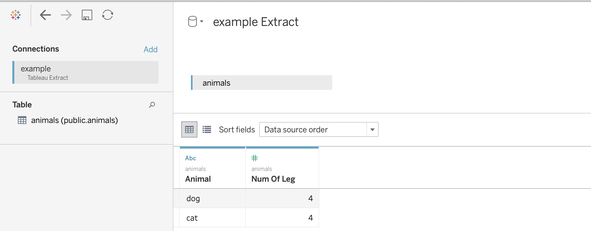

Usage Examples
==============

Writing to a Hyper Extract
--------------------------

.. code-block:: python

   import pandas as pd
   import pantab

   df = pd.DataFrame([
       ["dog", 4],
       ["cat", 4],
   ], columns=["animal", "num_of_legs"])

   pantab.frame_to_hyper(df, "example.hyper", table="animals")

The above example will write out to a file named "example.hyper", which Tableau can then report off of.

Reading a Hyper Extract
-----------------------

.. code-block:: python

   import pantab

   df = pantab.frame_from_hyper("example.hyper", table="animals")
   print(df)

Working with Schemas
--------------------

By default tables will be written to the "public" schema. You can control this behavior however by specifying a ``tableauhyperapi.TableName`` when reading / writing extracts.

.. code-block:: python

   import pandas as pd
   import pantab
   from tableauhyperapi import TableName

   # Let's write somewhere besides the default public schema
   table = TableName("not_the_public_schema", "a_table")

   df = pd.DataFrame([
       ["dog", 4],
       ["cat", 4],
   ], columns=["animal", "num_of_legs"])

   pantab.frame_to_hyper(df, "example.hyper", table=table)

   # Can also be round-tripped
   df2 = pantab.frame_from_hyper("example.hyper", table=table)

.. note::

   If you want to publish a hyper file using the Tableau Server REST API and you're using using a version prior to 2020.1 you'll need to have a single table named ``Extract`` that uses the ``Extract`` schema (``Extract.Extract``).

Reading and Writing Multiple Tables
-----------------------------------

``frames_to_hyper`` and ``frames_from_hyper`` can write and return a dictionary of DataFrames for Hyper extract, respectively.

.. code-block:: python

   import pandas as pd
   import pantab
   from tableauhyperapi import TableName

   dict_of_frames = {
       "table1": pd.DataFrame([[1, 2]], columns=list("ab")),
       TableName("non_public_schema", "table2"): pd.DataFrame([[3, 4]], columns=list("cd")),
   }

   pantab.frames_to_hyper(dict_of_frames, "example.hyper")

   # Can also be round-tripped
   result = pantab.frames_from_hyper("example.hyper")

.. note::

   While you can write using ``str``, ``tableauhyperapi.Name`` or ``tableauhyperapi.TableName`` instances, the keys of the dict returned by ``frames_from_hyper`` will always be ``tableauhyperapi.TableName`` instances

Appending Data to Existing Tables
---------------------------------

By default, ``frame_to_hyper`` and ``frames_to_hyper`` will fully drop and reloaded targeted tables. However, you can also append records to existing tables by supplying ``table_mode="a"`` as a keyword argument.

.. code-block:: python

   import pandas as pd
   import pantab

   df = pd.DataFrame([
       ["dog", 4],
       ["cat", 4],
   ], columns=["animal", "num_of_legs"])

   pantab.frame_to_hyper(df, "example.hyper", table="animals")

   new_data = pd.DataFrame([["moose", 4]], columns=["animal", "num_of_legs"])

   # Instead of overwriting the animals table, we can append via table_mode
   pantab.frame_to_hyper(df, "example.hyper", table="animals", table_mode="a")

Please note that ``table_mode="a"`` will create the table(s) if they do not already exist.

Issuing SQL queries
-------------------

With ``frame_from_hyper_query``, one can execute SQL queries against a Hyper file and retrieve the resulting data as a DataFrame. This can be used, e.g. to retrieve only a part of the data (using a ``WHERE`` clause) or to offload computations to Hyper.

.. code-block:: python

   import pandas as pd
   import pantab

   df = pd.DataFrame([
       ["dog", 4],
       ["cat", 4],
       ["moose", 4],
       ["centipede", 100],
   ], columns=["animal", "num_of_legs"])

   pantab.frame_to_hyper(df, "example.hyper", table="animals")

   # Read a subset of the data from the Hyper file
   query = """
   SELECT animal
   FROM animals
   WHERE num_of_legs > 4
   """
   df = pantab.frame_from_hyper_query("example.hyper", query)
   print(df)

   # Let Hyper do an aggregation for us - it could also do joins, window queries, ...
   query = """
   SELECT num_of_legs, COUNT(*)
   FROM animals
   GROUP BY num_of_legs
   """
   df = pantab.frame_from_hyper_query("example.hyper", query)
   print(df)

Providing your own HyperProcess
-------------------------------

For convenience, pantab's functions internally spawn a `HyperProcess<https://help.tableau.com/current/api/hyper_api/en-us/reference/py/tableauhyperapi.html#tableauhyperapi.HyperProcess>`_. In case you prefer to spawn your own ``HyperProcess``, you can supply it to pantab through the ``hyper_process`` keyword argument.

By using your own ``HyperProcess``, you have full control over all its startup paramters.
In the following example we use that flexibility to:

- enable telemetry, thereby making sure the Hyper team at Tableau knows about our use case and potential issues we might be facing
- `disable log files<https://help.tableau.com/current/api/hyper_api/en-us/reference/sql/loggingsettings.html#LOG_CONFIG>`_, as we operate in some environment with really tight disk space
- opt-in to the `new Hyper file format<https://help.tableau.com/current/api/hyper_api/en-us/reference/sql/databasesettings.html#DEFAULT_DATABASE_VERSION>`_

By reusing the same ``HyperProcess`` for multiple operations, we also save a few milliseconds. While not noteworthy in this simple example, this might be a good optimization in case you call ``frame_to_hyper`` repeatedly in a loop.

.. code-block:: python
   import pandas as pd
   import pantab
   from tableauhyperapi import HyperProcess, Telemetry
   df = pd.DataFrame([
       ["dog", 4],
       ["cat", 4],
   ], columns=["animal", "num_of_legs"])
   parameters = {"log_config": "", "default_database_version": "1"}
   with HyperProcess(Telemetry.SEND_USAGE_DATA_TO_TABLEAU, parameters=parameters) as hyper:
       # Insert some initial data
       pantab.frame_to_hyper(df, "example.hyper", table="animals", hyper_process=hyper)

       # Append additional data to the same table using `table_mode="a"`
       new_data = pd.DataFrame([["moose", 4]], columns=["animal", "num_of_legs"])
       pantab.frame_to_hyper(df, "example.hyper", table="animals", table_mode="a", hyper_process=hyper)
