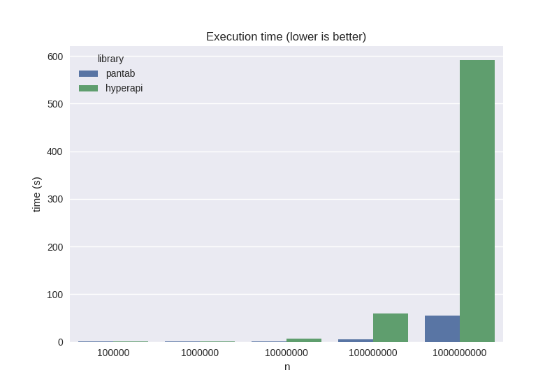

pantab
======

.. toctree::
   :hidden:

   examples
   caveats
   api
   changelog
   support

What is it?
-----------

``pantab`` is a Python wrapper around Tableau's `Hyper API <https://tableau.github.io/hyper-db/>`_ which promotes usage of the `pandas DataFrame <https://pandas.pydata.org/pandas-docs/version/0.23.4/generated/pandas.DataFrame.html>`_ to seamlessly generate and read hyper files.

How do I get it?
----------------

``pantab`` requires Python 3.6+ and can run on any Python-supported OS. Installation is as easy as:

.. code-block:: bash

   python -m pip install pantab

Why should I use it?
--------------------

``pantab`` is faster than what you would write by hand, in less lines of code. Consider the below benchmark:

This was generated from the output of the below code on Manjaro Linux with 4.6 GHz CPU and 16 GB of memory.

.. code-block:: python

   import itertools
   import time

   import numpy as np
   import pandas as pd
   import pantab
   from tableauhyperapi import (
       Connection,
       CreateMode,
       HyperProcess,
       Inserter,
       SqlType,
       TableDefinition,
       TableName,
       Telemetry,
   )

   def write_via_pantab(proc: HyperProcess, n: int):
       df = pd.DataFrame({"column": np.ones(n, dtype=np.int16)})
       pantab.frame_to_hyper(df, "example.hyper", table="table", hyper_process=proc)

   def write_via_hyperapi(proc: HyperProcess, n: int):
       data_to_insert = np.ones(n, dtype=np.int16)

       table = TableDefinition(
           table_name=TableName("table"),
           columns=[TableDefinition.Column(name="column", type=SqlType.int())],
       )

       with Connection(
           endpoint=proc.endpoint,
           database="example.hyper",
           create_mode=CreateMode.CREATE_AND_REPLACE,
       ) as conn:
           conn.catalog.create_table(table)

           with Inserter(conn, table) as inserter:
               for data in data_to_insert:
                   inserter.add_row([data])
               inserter.execute()

   ns = (100_000, 1_000_000, 10_000_000, 100_000_000, 1_000_000_000)
   funcs = (write_via_pantab, write_via_hyperapi)
   for n, func in itertools.product(ns, funcs):
       with HyperProcess(telemetry=Telemetry.DO_NOT_SEND_USAGE_DATA_TO_TABLEAU) as hyper:
           start = time.time()
           func(hyper, n)
           end = time.time()
           print(
               f"Total seconds for function {func.__name__} with {n} rows: {end - start}"
           )

Running this script may yield the below

.. code-block:: sh

   Total seconds for function write_via_pantab with 100_000 rows: 0.026696205139160156
   Total seconds for function write_via_hyperapi with 100000 rows: 0.08622312545776367
   Total seconds for function write_via_pantab with 1000000 rows: 0.10160708427429199
   Total seconds for function write_via_hyperapi with 1000000 rows: 0.6384274959564209
   Total seconds for function write_via_pantab with 10000000 rows: 0.7043006420135498
   Total seconds for function write_via_hyperapi with 10000000 rows: 6.226941108703613
   Total seconds for function write_via_pantab with 100_000_000 rows: 5.718722820281982
   Total seconds for function write_via_hyperapi with 100000000 rows: 59.03396558761597
   Total seconds for function write_via_pantab with 1000000000 rows: 54.43922758102417
   Total seconds for function write_via_hyperapi with 1000000000 rows: 591.2542216777802
